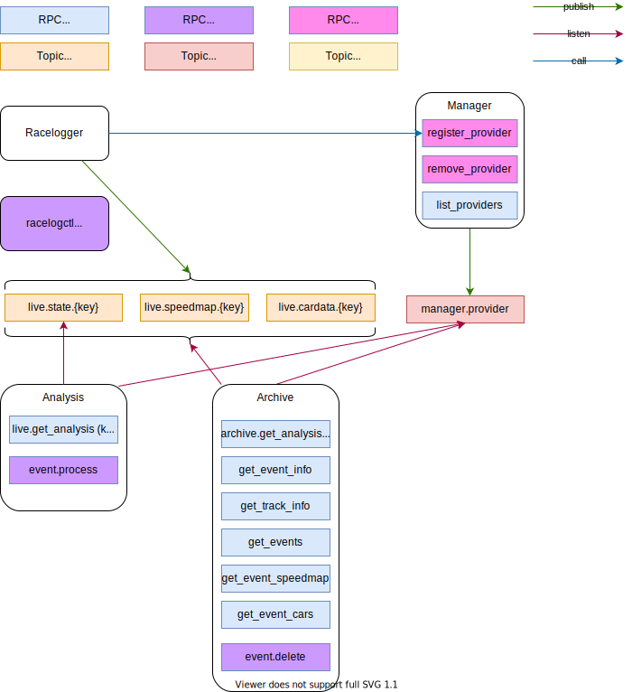

Architecture
============

The overall picture looks like this

Upon connecting to the local iRacing instance the Racelogger registers with the backend with a unique id (this is generated via the current iRacing weekend info from telemetry).

The manager announces the provider changes  on the `manager.provider` topic. 

The analysis and archive components listen to this topic and prepare themselves 
to receive data from the topic `live.state.{id}` to which the Racelogger will post its data. 

At the end of recording the Racelogger calls the `remove_provider` endpoint. The manager in turn announces this event on the topic `manager.provider`

Endpoints
---------

.. list-table:: 
    :widths: auto
    :header-rows: 1

    * - Prefix 
      - Description    
      - User 
      - Access

    * - racelog.public.
      - used for public access (mainly frontend)
      - anonymous
      - call, subscribe
    
    * - racelog.dataprovider.
      - used by racelogger to publish race data
      - datapublisher
      - call, publish, subscribe

    * - racelog.manager.
      - used by the backend apps
      - backend
      - call, register, publish, subscribe
   
    * - racelog.admin.
      - used by admin CLI
      - admin
      - call, register, publish, subscribe

Crossbar
--------

The following snippet can be used as a template for a crossbar server.

.. literalinclude:: crossbar.config
  :language: json
  :linenos: 

Migration
---------

Racelogger
^^^^^^^^^^

.. list-table:: 
    :widths: auto
    :header-rows: 1

    * - Current
      - Access
      - New

    * - racelog.register_provider
      - call
      - racelog.dataprovider.register_provider
    
    * - racelog.remove_provider
      - call
      - racelog.dataprovider.remove_provider

    * - racelog.store_event_extra_data
      - call
      - racelog.dataprovider.provide_event_extra_data
    
    * - racelog.state.{id}
      - publish
      - racelog.public.live.state.{id}

Web
^^^

.. list-table:: 
    :widths: auto
    :header-rows: 1

    * - Current
      - Access       
      - New
      - Where
      - Description

    * - racelog.archive.event_info
      - call
      - racelog.public.get_event_info
      - load event
      - get info about selected event

    * - racelog.archive.events
      - call
      - racelog.public.get_events
      - startup
      - get list of stored events

    * - racelog.list_providers
      - call
      - racelog.public.list_providers
      - startup/request
      - get list of current race data providers

    * - racelog.get_track_info
      - call
      - racelog.public.get_track_info
      - load event
      - get info about track

    * - racelog.analysis.archive
      - call
      - racelog.public.archive.get_event_analysis
      - load event
      - get stored analysis data
    
    * - racelog.analysis.live
      - call
      - racelog.public.live.get_event_analysis
      - live
      - get current live analysis data
    
    * - racelog.state.{id}
      - topic
      - racelog.public.live.state.{id}
      - live
      - get current state from racelogger 
    
    * - racelog.archive.wamp.delta
      - call
      - racelog.public.archive.state
      - race replay
      - used to get state messages for a time range
    
